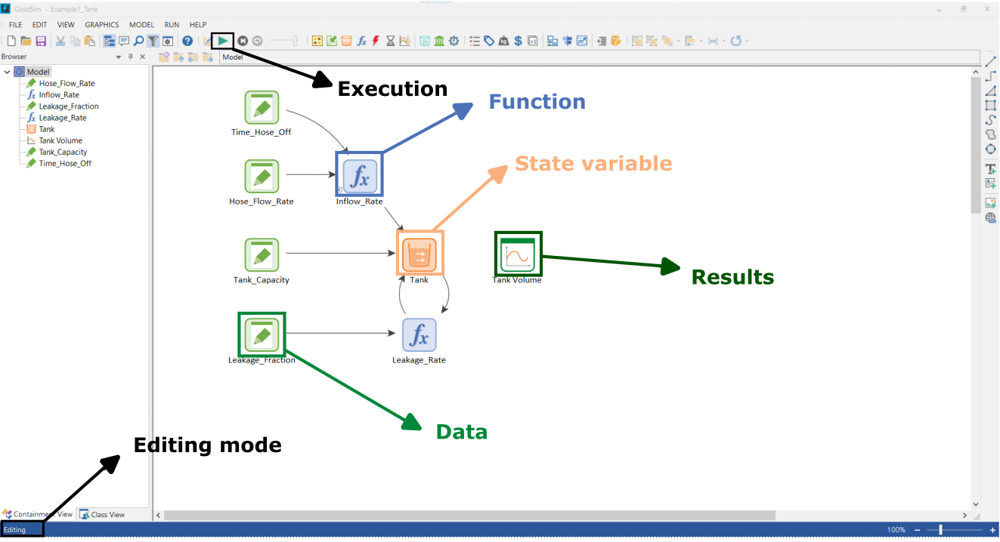

## Model 1 - Example

[Download](https://github.com/SergioCoboLopez/Workshop_ESA/blob/main/GoldSim_Models/Model1_Example.gsm){: .btn }

[Download Video](https://github.com/SergioCoboLopez/Workshop_ESA/tree/main/data/videos){: .btn }

[Watch me](https://www.youtube.com/watch?v=htNLMYaaiCE){: .btn }

This model is a simple example provided by GoldSim in their basic course and can be found [here](https://www.goldsim.com/Courses/BasicGoldSim/Unit3/Lesson2/). 
The model exploits the analogy of a water management system to describe
a simple scenario and show the basic elements used in GoldSim. 

Image courtesy of GoldSim

In this model, a hose is pouring water into a pool ('Tank') with a capacity of $$30000$$ liters (Tank_capacity)  
over a period of 2 days (Time_Hose_off). The hose has a flow rate of 30 liters per hour. However, the tank 
has a leakage problem, where it loses 30% of its water every hour (Time_Hose_off)

Our goal is to monitor the amount of water over a specified period of time, which is why we have designated
 the "Tank" as the state variable. The tank receives water through the Inflow_rate function and loses water
 through the Leakage_rate function The data elements are constant values that define features of the tank and
the functions. We track the state of the pool through the result element 'Tank_volume'.

The simulation time is 3 days and the integration step is 15 min.

|Data element|Units|Value|
|------------|----------|-------|
|Tank_capatity   |l  |30000|
|Hose_flow_rate  |l/h|30  |
|Time_hose_off   |d  |2    |
|Leakage fraction|%/h|15|

