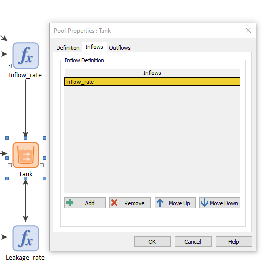

## Instructions on how to build this model

### General tips for models

Whenever you introduce an element in a GoldSim model, it is important to:

**Units** - GoldSim enforces unit consistency. If the units of two or more elements are not consistent, GoldSim will not run the model. Make sure you choose your units correctly.

**Name an description** - This might sound trivial, but it is very important to give specific and informative names to your GoldSim models. Adding a short description of what that element does might save your future self a lot of problems.

### Step 1 -  Introduce a pool

As discussed before, pools encode state variables in GoldSim. The state variable is the most important part of any model. Introduce a pool element:

**Suggested name**: 'Tank'

**Suggested description**: 'Stores water'

**Units**: liters (l)

**Flow units**: liters per hour (l/hr) (in general, flow units are going to be a rate, a quantity per unit of time.)

We will set an upper bound for the Tank. To do that we will **introduce a data element**:

**Suggested name**: Tank_capacity

**Suggested description**: 'Maximum volume allowed'

**Units**: liters (l)

**Data definition**: 30000 l

Go back to the Tank and type 'Tank_capacity' in the upper bound box. You might think you could just type 30000 l in the upper bound box. However, if you had several tanks all with the same capacity, it would be very tedious to change
every upper bound individually. Also, you would be more likely to make a mistake.

### Step 2 - Pour water into the tank

Now we model the hose that fills the tank with water. We do this in four substeps:

   1. Define a hose flow rate: introduce a new data element that sets the rate at which water flows into the tank. 

   **Suggested name**: 'Hose_flow_rate'

   **Suggested description**: 'rate at which water flows'

   **Units**: liters per hour (l/hr) 

   **Data definition**: 30 l/hr

   2. Define the time at which the hose switches off: introduce another data element:

   **Suggested name**: 'Time_hose_off'

   **Suggested description**: Not necessary, the name is pretty self explanatory.

   **Units**: days (d)

   **Data definition**: 2 d

   3. Define a function: introduce an expression element: 

   **Suggested name**: Inflow_rate'

   **Suggested description**: 'function describing rate at which water flows'

   **Units**: liters per hour (l/hr).

   **Data definition**: 'if(ETime< Time_hose_off, Hose_flow_rate, 0 l/min)'. This expression has the following meaning: if the time of the simulation is smaller than two days, the flow rate is equal to $$30 l/hr$$. Otherwise, it is 0. 'ETime' represents the simulation time of GoldSim. As you can see, the parentheses contains three instances separated by commas. 
These are the rules of GoldSim and in programming this is called [syntax](https://en.wikipedia.org/wiki/Syntax_(programming_languages))
	
   4. Connect the function to the Tank.

   We have defined a function, but it is not connected to the tank in any way. To do this, go back to Tank and select the 'Inflows' tab. Click the 'Add' button and type 'Inflow_rate' (or whatever the name of your function is)

### Step 4 - Leakage

This process is very similart to the previous one:

1. Define a hose flow rate: introduce a new data element that sets the rate at which water flows into the tank. 

   **Suggested name**: 'Hose_flow_rate'

   **Suggested description**: 'rate at which water flows'

   **Units**: liters per hour (l/hr) 

   **Data definition**: 30 l/hr

   2. Define the time at which the hose switches off: introduce another data element:

   **Suggested name**: 'Time_hose_off'

   **Suggested description**: Not necessary, the name is pretty self explanatory.

   **Units**: days (d)

   **Data definition**: 2 d

   3. Define a function: introduce an expression element: 

   **Suggested name**: Inflow_rate'

   **Suggested description**: 'function describing rate at which water flows'

   **Units**: liters per hour (l/hr).

   **Data definition**: 'if(ETime< Time_hose_off, Hose_flow_rate, 0 l/min)'. This expression has the following meaning: if the time of the simulation is smaller than two days, the flow rate is equal to $$30 l/hr$$. Otherwise, it is 0. 'ETime' represents the simulation time of GoldSim. As you can see, the parentheses contains three instances separated by commas. 
These are the rules of GoldSim and in programming this is called [syntax](https://en.wikipedia.org/wiki/Syntax_(programming_languages))
	
   4. Connect the function to the Tank.

   We have defined a function, but it is not connected to the tank in any way. To do this, go back to Tank and select the 'Inflows' tab. Click the 'Add' button and type 'Inflow_rate' (or whatever the name of your function is)

### Step 5 - Model settings

