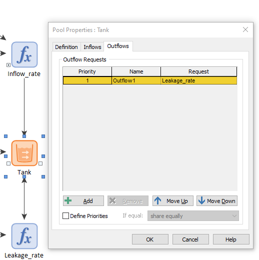
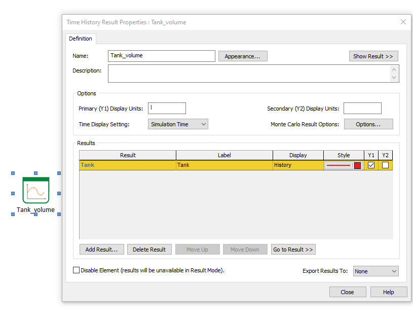

## Instructions on how to build this model

An excellent explanation on how to build this model can be found [here](https://www.goldsim.com/Courses/BasicGoldSim/Unit4/Lesson3/). However, these instructions here align more closely with the general concept of this tutorial.

### General tips for GoldSim models.

Whenever you introduce an element in a GoldSim model, it is important to pay attention to:

1. **Units** - Make sure your units are consistent: GoldSim enforces unit consistency. If the units of two or more elements are not consistent with each other, GoldSim will not run the model.

2. **Name an description** - It is very important to give informative and precise names to the elements that comprise your GoldSim models. Likewise, short descriptions can be very helpful for your future self.

### 1 -  Introduce a pool

In GoldSim, Pool elements encode state variables. State variables are the most important element in a model, so that is where we should start. Let's start building our model by introducing a Pool element. Right click in any point of the graphics pane, select 'Insert Element', go to 'Stocks', and then choose a pool. Introduce the following information:

**Suggested name**: 'Tank'

**Suggested description**: 'Stores water'

**Units**: liters (l)

**Flow units**: liters per hour (l/hr) (in general, flow units are rates. Therefore, they will typically be the unit you selected over time.)

### 2. Set an upper bound to the Tank

We will use a **data element**. Right click in any point of the graphics pane, select 'Insert Element', go to 'Inputs', and select the 'Data' element. Introduce the following information:

**Suggested name**: Tank_capacity

**Suggested description**: 'Maximum volume allowed'

**Units**: liters (l)

**Data definition**: 30000 l

Return to the Tank and type 'Tank_capacity' in the 'upper bound' box. You might think you could have just typed '30000 l' in the 'upper bound' box. And you are right. However, imagine you had a more complex model with, say, five tanks, all with the same capacity. In that scenario, changing every upper bound would be a tedious task and could potentially lead to mistakes. Therefore, typing 'Tank_capacity' is a much easier and safer option.

### 3 - Pour water into the tank

Now we model the hose that fills the tank with water. We do this in four substeps:

1. Define a hose flow rate: introduce a new data element that sets the rate at which water flows into the tank. 

   **Suggested name**: 'Hose_flow_rate'

   **Suggested description**: 'rate at which water flows'

   **Units**: liters per hour (l/hr) 

   **Data definition**: 30 l/hr

2. Define the time at which the hose switches off: introduce another data element:

   **Suggested name**: 'Time_hose_off'

   **Suggested description**: Not necessary, the name is pretty self explanatory.

   **Units**: days (d)

   **Data definition**: 2 d

3. Define a function: introduce an expression element: 

   **Suggested name**: Inflow_rate'

   **Suggested description**: 'function describing rate at which water flows'

   **Units**: liters per hour (l/hr). (Note that the units of the function are the same as the flow units of our tank'

   **Equation**: 'if(ETime< Time_hose_off, Hose_flow_rate, 0 l/min)'. This expression has the following meaning: if the time of the simulation is smaller than two days, the flow rate is equal to $$30 l/hr$$. Otherwise, it is 0. 'ETime' represents the simulation time of GoldSim. As you can see, the parentheses contains three instances separated by commas. 
These are the rules of GoldSim and in programming this is called [syntax](https://en.wikipedia.org/wiki/Syntax_(programming_languages))
	
4. Connect the function to the Tank.

   We have defined a function, but it is not connected to the tank in any way. To do this, go back to Tank and select the 'Inflows' tab. Click the 'Add' button and type 'Inflow_rate' (or whatever the name of your function is)

### 4 - Leak water out of the tank

This process is very similart to the previous one:

1. Define a hose flow rate: introduce a new data element that sets the rate at which water flows into the tank. 

   **Suggested name**: 'Leakage_fraction'

   **Suggested description**: 'percentage of water that leaks out the tank'

   **Units**: percentage per hour (%/hr) 

   **Data definition**: 15.0 %/hr

2. Define a function: introduce an expression element: 

   **Suggested name**: 'Leakage_rate'

   **Suggested description**: Not necessary, the name is pretty self explanatory.

   **Units**: liters per hour (l/hr)

   **Equation**: 'Leakage_fraction*Tank'
	
3. Connect the function to the Tank.

   In this case, water flows out of the Tank and not into it. To connect the leakage rate to the tank, select the 'Outflows'tab. Click the 'Add' button and type 'Leakage_rate'

### Step 5 - Results

To visualize the results of the simulation, we will introduce a Time History Result Element.

**Suggested name**: 'Tank_volume'

As mentioned earlier, we are interested in knowing the value of the state variable over time. To do
that click on the 'Add Result...' box and click 'Tank' on the dialog. You can of course select as
many results as you want.

### Step 6 - Model Settings

The final step before running our model is to define the duration of the simulation and the step time. To do this, press 'F2' or click the cog button in the toolbar of GoldSim. Set the duration of the simulation to 3 days and the step
time to 15 minutes. The step time is the frequency with which GoldSim does its calculations. The smaller the step size, the more accurate the calculations are going to be, but it
will also mean more memory and computational resources.

### Step 7 - Run the simulation

Press F5 or click the play button in the toolbar of GoldSim to enjoy your hard work
