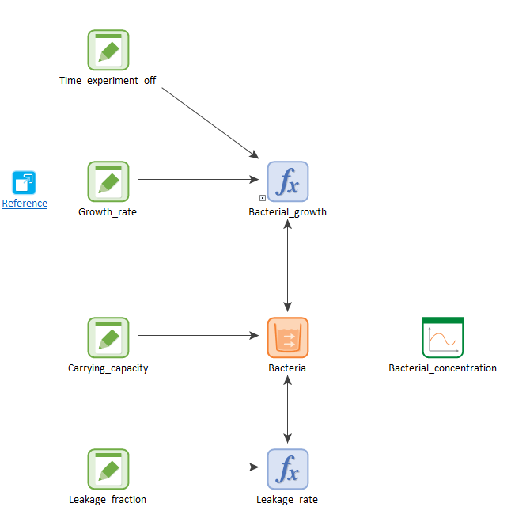

## Model 2 - Example ecology. 

[Download](https://github.com/SergioCoboLopez/Workshop_ESA/blob/main/GoldSim_Models/Model2_Example_Ecology.gsm){: .btn } 

[Watch me](https://www.youtube.com/watch?v=imbY64YM3fE){: .btn }

You might be asking yourself how water management systems can help describe ecological models. This model gives you a basic answer. Model 2 is a modified version of 
Model 1 that describes a simulated experiment with bacterial exponential growth (inflow) and bacterial sampling (outflow).

1. **Tank (l)** --> **Bacteria (item/ml)**: The tank of water becomes now the concentration of bacteria. This is the new [state variable](https://en.wikipedia.org/wiki/State_variable)
 . Because bacteria are usually measured in concentrations, the 'bacterial tank' units are now 'items/ml' (usually, density is measured in 'cells/ml,' but GoldSim does not provide 'cell' as a standard unit). Remember that GoldSim is very consistent with units.

2. **Tank_capacity (l)** --> **Carrying_capacity (item/ml)**: The tank capacity becomes the carrying capacity, the maximum concentration of bacteria in a system.

3. **Inflow_rate (l/h)** --> **Bacterial_growth (item/ml h)**: The 'inflow' of bacteria comes from bacterial exponential or Malthusian growth. That is, the bacterial growth is proportional
 to the actual concentration of bacteria. The time at which the hose switches off is the experiment time.

4. **Hose_flow_rate (l/h)** --> **Growth_rate (1/h)=0.025 1/hr**: The growth rate controls how fast bacteria replicate.

5. **Time_hose_off (d)** --> **Time_experiment (h)= 24 hr** : From 2 days to 24 hours.

6. **Leakage_rate (l/h)** --> **Leakage_rate (item/ml h)**: The outflow is reinterpreted as a sampling rate: an extraction of 15% of the total bacterial concentration every hour.

7. Simulation time: 24 h; basic step: 10 min. This model has a smaller timescale and simulation time.

|Data element          |Units      |Value|
|---------------------:|----------:|-------:|
|     Carrying_capacity|    item/ml|     1e9|
| Initial_concentration|    item/ml|     1e3|
|           Growth_rate|       1/hr|   0.025|
|   Time_experiment_off|         hr|   24 hr|
|         Sampling_rate|       %/hr|       1|
|Time_hose_off         |          d|       2|
|Leakage fraction      |        %/h|      15|

Image courtesy of GoldSim

