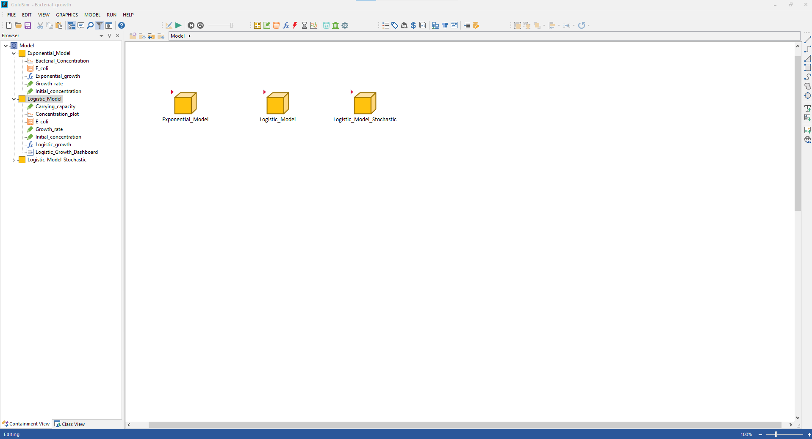
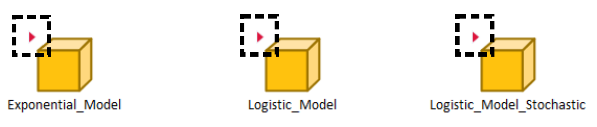
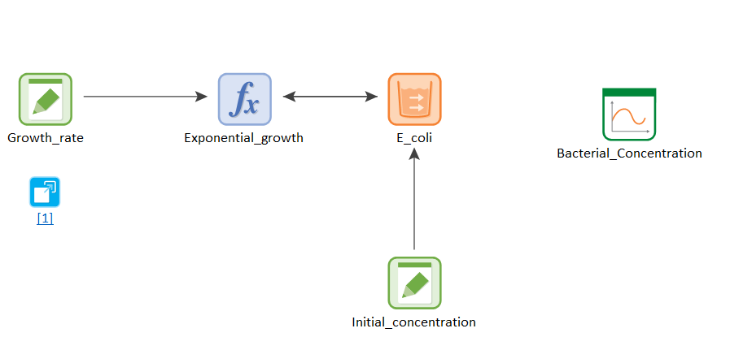
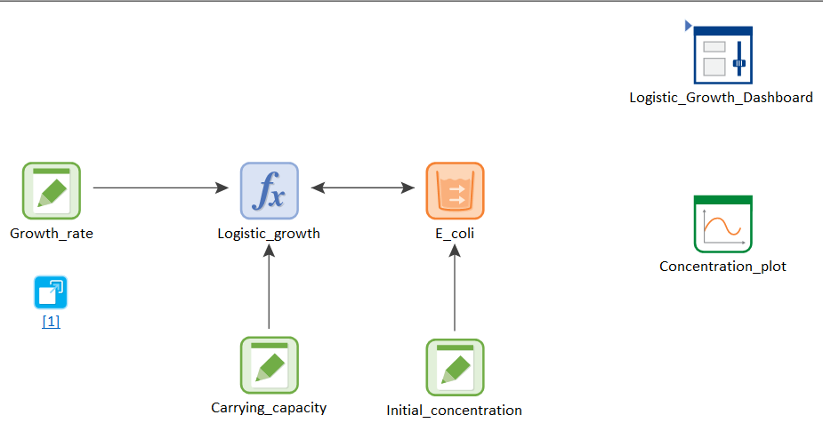
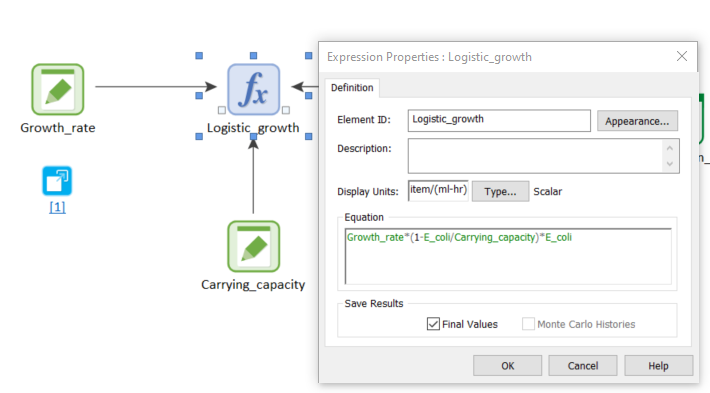
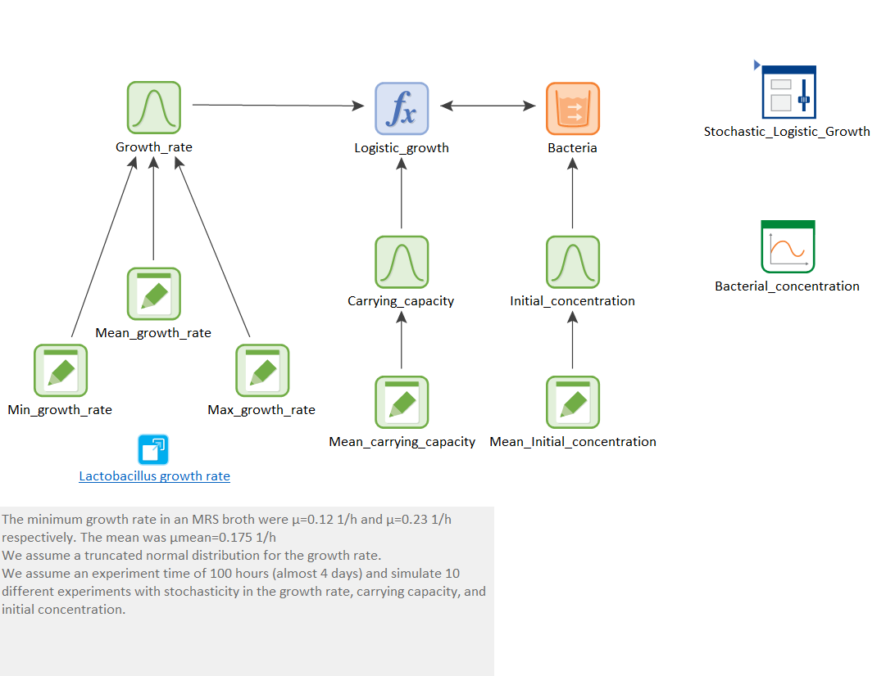
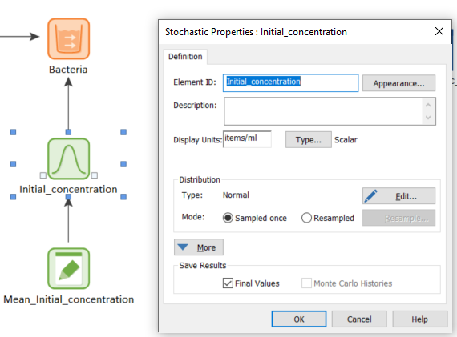
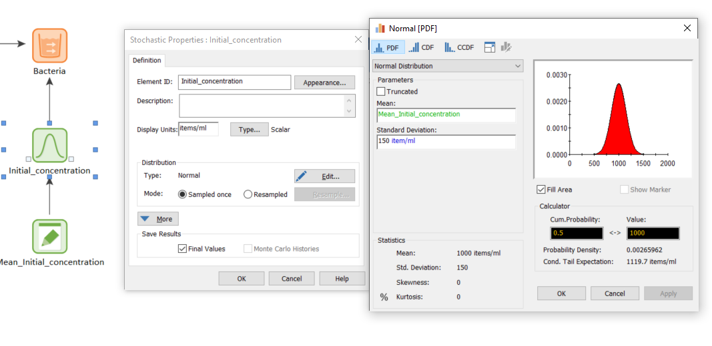

## Model 3 - Bacterial growth

[Download](https://github.com/SergioCoboLopez/Workshop_ESA/blob/main/GoldSim_Models/Bacterial_growth.gsm){: .btn }

This model is a refinement of the previous model. 
The first thing that you will notice when you open it is the existence of a new element that we have not discussed yet:

Image courtesy of GoldSim

The three yellow elements are called [containers](https://www.goldsim.com/Courses/BasicGoldSim/Unit9/Lesson2/). Containers are used to store small parts of the models for esthetical reasons (not having lots of elements scattered around your workspace) or because you want to build a modular model, where each part of the model is as independent as possible from the rest. 

Notice the red marker on the top left corner of the containers:

Image courtesy of GoldSim

These indicate that containers are localized. When a container is localized, the elements inside are hidden from the elements of the rest of the model. In this case, each container contains a different version of a model for bacterial growth:

### Exponential Model

If you go to the 'Exponential_Growth' container, you will see this model:

Image courtesy of GoldSim

This model is not very different from Model 2. In this case, there is no carrying capacity. The bacterial pool includes an upper bound of $1e20$ items/ml to prevent GoldSim from reaching
 very high concentrations and using too much memory. There is also a link to the paper that has the growth rate of *E. Coli*.

Remember GoldSim implicitly models differential equations. This is the equation for the exponential growth in this model:

$$\begin{equation*}
\frac{dB}{dt}=rB
\end{equation*}$$

|Letter|Element|Units  |
|----|----------|-------|
|    B|Bacteria    |items/ml  |
|dB/dt|Growth      |items/ml h|
|r    |Growth rate |1/h       |

### Logistic Model

If you go to the 'Exponential_Growth' container, you will see this model:

Image courtesy of GoldSim

You will probably notice a new element that we had not discussed before:

Image courtesy of GoldSim

This a 'DashBoard'. DashBoards are extensively discussed in [Unit 16](https://www.goldsim.com/Courses/BasicGoldSim/Unit16/Lesson1/) 
of the [GoldSim Introduction Course](https://www.goldsim.com/Courses/BasicGoldSim/), but shortly speaking, a DashBoard is a special type of container that allows you to generate 
[GoldSim Player files](https://www.goldsim.com/Courses/BasicGoldSim/Unit16/Lesson4/), like the ones discussed below. You can open and run GoldSim Player files without a license.

Back to the model, this is a reformulation of Model 2, where the carrying capacity is explicitly implemented in the 'Logistic_growth' function, as shown below:

Image courtesy of GoldSim

This simply makes the model closer to its mathematical formulation, and does not imply the previous model was wrong.
Another difference respect to the previous model is that there is no data element for finishing the experiment. This is not strictly necessary, as it is possible to stop the simulation at any time you wish in 
the Simulations settings.

This is the equation for the exponential growth in this model:

$$\begin{equation*}
\frac{dB}{dt}=r(1-B/K)B
\end{equation*}$$

|Letter|Element     |Units     |
|----|----------|-------|
|    B|Bacteria    |items/ml  |
|dB/dt|Growth      |items/ml h|
|r    |Growth rate |1/h       |
|K    |Carrying capacity |items/ml|

### Logistic Model Stochastic

Finally, we model a bacterial growth with stochastic bacterial growth rate, carrying capacity and initial bacterial concentration are stochastic variables. Stochastic processes are very commont in ecology; think about it: Is the
 initial concentration of bacteria in an experiment fixed or is there some uncertainty due to measurements errors? The same is probably true for the growth rate and the carrying capacity: 
are these unique and fixed rates? Or do they vary between minimum and maximum values depending on environmental or genetic conditions? For instance, some bacterial cells might have been selected to grow faster than others. Or 
maybe a rich media provides resources for a higher carrying capacity. GoldSim allows us to explore these scenarios and this model provides a simple example of it. 

Image courtesy of GoldSim

Here we find a new element, which is crucial to stochastic modeling: the 'Stochastic':

Image courtesy of GoldSim

If you click on the 'Edit' button, you can see how to define the stochastic element:

Image courtesy of GoldSim

In particular, there are many probability distributions that the parameter can take. In this case, we considered the [normal distribution](https://en.wikipedia.org/wiki/Normal_distribution). Normal or Gaussian distributions have a 
mean or expectation value $$\mu$$ that represents the most common outcome. As you move away from the mean, the likelihood of values occurring decreases. The standard deviation $$\sigma$$ represents how spread the distribution is.
The height distribution of adults follows a [normal distribution](https://ourworldindata.org/human-height#distribution-of-adult-heights).
