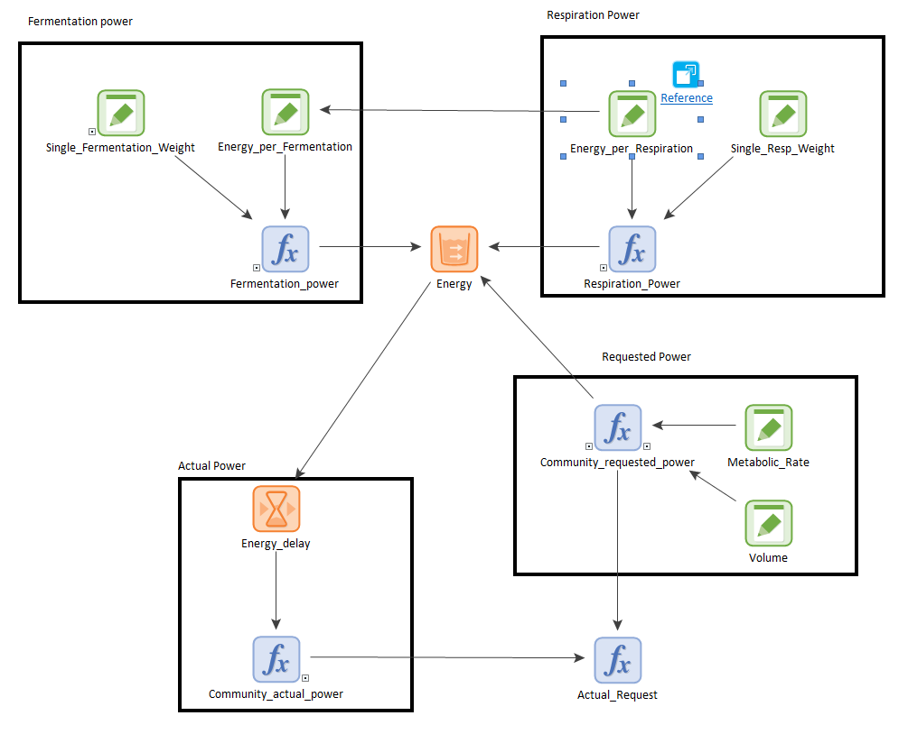

### Energy Production

This section discusses the technical details of this module.

It was assumed that a single respiration cycle yielded 26 ATP molecules, which convert to $$E_{resp}=8.229 meV$$ (data element '**Energy_per_Respiration**' in the GoldSim representation).

For simplicity, it was assumed that a cycle of fermentation yielded 13 ATP molecules (half the production of a respiration cycle), which convert $$E_{ferm}=4.114 meV$$ meV$$ (data element '**Energy_per_Fermentation**' in the GoldSim representation).

The total respiration power was calculated as:

$$\begin{equation}
W^{tot}_{resp} = \frac{M^{tot}_{resp}}{M^{B}_{resp}} E_{resp} \, .
\label{eq:W_resp}
\end{equation}$$

Here, $$M^{tot}_{resp}$$ is the rate of biomass being processed by respiration (the details will be discussed in [Metabolism](https://sergiocobolopez.github.io/Workshop_ESA/GoldSim_Models/Model_5-Metabolism.html) ), $$M^{B}_{resp}$$ is the mass of a single respiration cycle, and $$E_{resp}$$ is the energy generated by a single respiration cycle. The equation assumes that the power generated by respiration is the number of respiration cycles per hour multiplied by the energy generated by a single respiration cycle. In the GoldSim representation, this is function element '**Respiration_Power**'

The total fermentation power was calculated in a similar way:

$$\begin{equation}
W^{tot}_{ferm} = \frac{M^{tot}_{ferm}}{M^{B}_{ferm}} E_{ferm} \, .
\label{eq:W_ferm}
\end{equation}$$

\ref{eq:W_form} correspond to function element '**Fermentation_Power**' in the GoldSim representation. The respiration and fermentation power in Eq ~\ref{eq:W_resp} and Eq ~\ref{eq:W_ferm} are dumped into the '**Energy**'. Bacteria request (or outflow) power from '**Energy**' :

$$\begin{equation}
W_{req}=B(t) W_b V \, ,
\label{eq:W_tot}
\end{equation}$$

where $$W^a_b=1.39 \cdot 10^{-13}$$ W is the active metabolic rate of E. Coli [DeLong et al, 2010](https://doi.org/10.1073/pnas.1007783107). We assume that the active metabolic rate is the power required by a cell to duplicate. $$B(t)$$ is the bacterial concentration at time $$t$$, and $$V$$ is the volume of the system. The GoldSim translation of \ref{eq:W_tot} is the function element '**Community_requested_power**': the product of data element '**Metabolic_Rate**', times '**Volume**', times pool element '**Bacteria**' in [Bacterial growth](https://sergiocobolopez.github.io/Workshop_ESA/GoldSim_Models/Model_5.html#bacterial-growth) container.

The power produced by the available resources in the system is given by the available energy in the '**Energy**' pool. This is given by:

$$\begin{equation}
W_{av}= W^{tot}_{resp} + W^{tot}_{ferm} \, ,
\label{W_av}
\end{equation}$$

which corresponds to function element '**Actual_Request**' in the GoldSim representation. This element acts as

