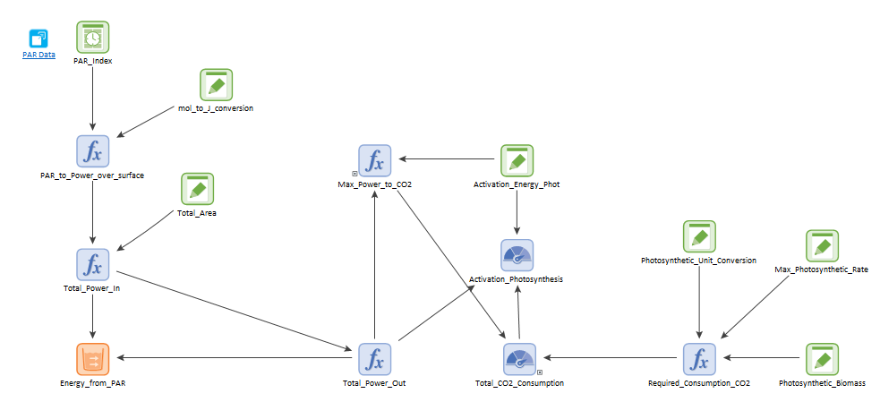

### Metabolism

This module simulates the processes of Respiration, Fermentation, and Photosynthesis. It also models the role of
Photosynthetic Active Radiation (PAR) in photosynthesis and electron Donor-to-Acceptor ratio (eDAR) on 
respiration and fermentation. *E. Coli* bacteria carry out fermentation and respiration for energy production,
while photosynthesis is carried out by an undefined primary producer. The chemical reactions for these three 
processes are:

Photosynthesis:

$$\begin{equation}\label{eq:Photosynthesis}
6 CO_2 + 6 H_2 O \rightarrow C_6H_{12}O_6 + 6 O_2
\end{equation}$$

Cellular respiration:

$$\begin{equation}\label{eq:Respiration}
C_6H_{12}O_6 + 6 O_2 \rightarrow 6 CO_2 + 6 H_2 O
\end{equation}$$

Ethanol fermentation:

$$\begin{equation}\label{eq:Fermentation}
C_6H_{12}O_6  \rightarrow C_6H_{12}O_6 + 2 CO_2
\end{equation}$$

These processes defined the state variables in this module: Glucose ($$C_6H_{12}O_6$$), Oxygen ($$6 O_2$$), Water
($$H_2O$$), Carbon Dioxide ($$6 CO_2$$), and Ethanol ($$C_6H_{12}O_6$$). Note that, for Oxygen and Carbon Dioxide
the state variables correspond to the weight of the minimum number of molecules required for a single cycle of 
either metabolic pathway. The units of the state variables were g/ml. Although these units are uncommon
in chemistry, they were consistent with biomass units of bacteria.

|State variable  |molecular weight (g/mole)|weight of a molecule (g)|
|:---------------|----------:|----------:|
|$$C_6H_{12}O_6$$| 180.156   |$$2.99\cdot 10^{-22}$$ |
|$$O_2$$         | 32        |$$5.31\cdot 10^{-23}$$ |
|$$H_2O$$        | 18.02     |$$2.99\cdot 10^{-23}$$ |
|$$CO_2$$        | 44.01     |$$7.31\cdot 10^{-23}$$ |
|$$C_6H_{12}O_6$$| 46.07     |$$2.99\cdot 10^{-22}$$ |

### Rates of pathways and PAR

The next step was to define the rate at which Oxygen, Glucose, Carbon Dioxide, and Water were processed in the
respective pathways. *E. Coli* consume $$O_2$$ at a minimum and maximum rates of $$q^{min}_{O}=1.67 \cdot 10^{-16}$$ g/cell h
and $$q^{max}_{O}=1.33\cdot 10^{-13} $$ g/cell h, respectively [Riedel et al, 2013](https://doi.org/10.1128/AEM.00756-13). By 
stoichiometry of cellular respiration we infer that minimum and maximum glucose consumption rates are 
$$q^{min}_{GR}=1.243 \cdot 10^{-16}$$ g/cell h and $$q^{max}_{GR}=1.246 \cdot 10^{-13} $$ g/cell h. That is, on a first approximation
oxygen and glucose have to be consumed at the same rate because they are part of the same process, only in different
quantities. Finally, fermentation was assumed to happen twice as fast as respiration 
$$q^{min}_{GF}=2.486 \cdot 10^{-16}$$ g/cell h and $$q^{max}_{GF}=1.492 \cdot 10^{-13} $$ g/cell h.

The rate at which photosynthesis occurs is more complicated, because it partially depends on the Photosynthetic Active
Radiation (PAR). PAR had its own submodule or container in the metabolic model:

The assumption is that the CO$$_2$$ maximum photosynthetic rate is $$q_{CP}= 2.648 \cdot 10^{-6}$$ g/ml h (data element
'Max_photosynthetic_rate' in the figure above. This rate was obtained from the estimation that a gram of leaf processes 
44.14 ppm of CO$$_2$$ per minute, converting ppm to mol/L and assuming a volume V=1 L. This is a very broad number, and 
needs to be refined in future iterations of the model. In any case, $$q_{CP}$$ is the rate in the case the Photosynthetic 
Active Radiation (PAR) is at its maximum. The reaction in Eq. \ref{eq:Photosynthesis} is not completely right, 
because photosynthesis needs light energy (from the Sun, in this case) to occur. If PAR is below certain threshold,
there cannot be photosynthesis. Here, we take the data in [Ge et al](https://doi.org/10.1007/s00704-010-0368-6) 
(the authors took PAR measurements in the San Francisco Bay Area of northern California and the PAR values are 
averaged over a year). The raw data is given in units of mol/m$$^2$$ h (moles of photons), so the first step is
 to convert moles of photons to Joules (J), which gives units of power per surface. Assuming a photosynthezing
 surface of 1 m$$^2$$, we get units of power. This is calculations are done in the left hand side of the model 
in the figure above.

The next step was to calculate the theoretical upper limit of CO$$_2$$ metabolization rate. In the PAR submodel, this
is the function element 'Max_power_to_CO2', which is given by the expression:

(Total_Power_Out/Activation_Energy_Phot)*(6*CO2_molecule_weight/1ml)

For convenience, let us refer to this quantity as $$q^{max}_{CP}$$. The expression above assumes that the number of 
cycles of photosynthesis is estimated as the power extracted from PAR divided by the activation energy of photosynthesis
 $$E^{ph}_a= 121672.6 meV$$. The number of cycles is multiplied by the weight of six molecules of CO$$_2$$, thus given the
 total biomass consumed per hour. However, this rate is upper- and bottom-limited. The upper limmit is $$q_{CP}$$ and the 
bottom limit comes from the activation energy itself. Therefore, if the power extracted by PAR was smaller than the
activation energy over an hour, the rate of CO$$_2$$ metabolized was set to 0 g/ml h. Conversely, if $$q^{max}_{CP}>q_{CP}$$, the rate of
CO$$_2$$ was $$q_{CP}$$.

### Respiration and Fermentation

The share of respiration and fermentation carried out by bacteria was a function of eDAR. 

