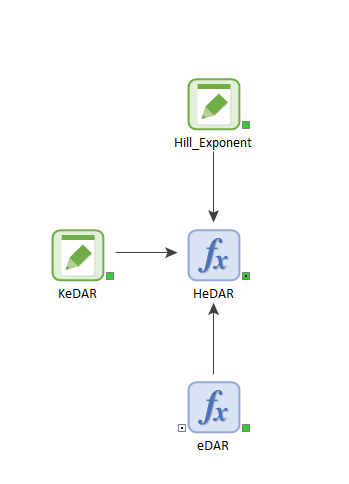

### Metabolism

This module simulates the processes of Respiration, Fermentation, and Photosynthesis. It also models the role of
Photosynthetic Active Radiation (PAR) in photosynthesis and electron Donor-to-Acceptor ratio (eDAR) on 
respiration and fermentation. *E. Coli* bacteria carry out fermentation and respiration for energy production,
while photosynthesis is carried out by an undefined primary producer. The chemical reactions for these three 
processes are:

Photosynthesis:

$$\begin{equation}\label{eq:Photosynthesis}
6 CO_2 + 6 H_2 O \rightarrow C_6H_{12}O_6 + 6 O_2
\end{equation}$$

Cellular respiration:

$$\begin{equation}\label{eq:Respiration}
C_6H_{12}O_6 + 6 O_2 \rightarrow 6 CO_2 + 6 H_2 O
\end{equation}$$

Ethanol fermentation:

$$\begin{equation}\label{eq:Fermentation}
C_6H_{12}O_6  \rightarrow C_6H_{12}O_6 + 2 CO_2
\end{equation}$$

These processes defined the state variables in this module: Glucose ($$C_6H_{12}O_6$$), Oxygen ($$6 O_2$$), Water
($$H_2O$$), Carbon Dioxide ($$6 CO_2$$), and Ethanol ($$C_6H_{12}O_6$$). Note that, for Oxygen and Carbon Dioxide
the state variables correspond to the weight of the minimum number of molecules required for a single cycle of 
either metabolic pathway. The units of the state variables were g/ml. Although these units are uncommon
in chemistry, they were consistent with biomass units of bacteria.

|State variable  |molecular weight (g/mole)|weight of a molecule (g)|
|:---------------|----------:|----------:|
|$$C_6H_{12}O_6$$| 180.156   |$$2.99\cdot 10^{-22}$$ |
|$$O_2$$         | 32        |$$5.31\cdot 10^{-23}$$ |
|$$H_2O$$        | 18.02     |$$2.99\cdot 10^{-23}$$ |
|$$CO_2$$        | 44.01     |$$7.31\cdot 10^{-23}$$ |
|$$C_6H_{12}O_6$$| 46.07     |$$2.99\cdot 10^{-22}$$ |

### Rates of pathways and PAR

The next step was to define the rate at which Oxygen, Glucose, Carbon Dioxide, and Water were processed in the
respective pathways. The $$O_2$$ minimum and maximum consumption rates of *E. Coli* doing performing cellular respiration 
are [Riedel et al, 2013](https://doi.org/10.1128/AEM.00756-13) :

$$q^{min}_{O2}=1.67 \cdot 10^{-16}$$ g/cell h

and

$$q^{max}_{O2}=1.33\cdot 10^{-13} $$ g/cell h

By stoichiometry of cellular respiration we infer that minimum and maximum glucose consumption rates are 
$$q^{min}_{GR}=1.243 \cdot 10^{-16}$$ g/cell h and $$q^{max}_{GR}=1.246 \cdot 10^{-13} $$ g/cell h. That is, on a first approximation
oxygen and glucose have to be consumed at the same rate because they are part of the same process, only in different
quantities. 

The fermentation rate was extracted from [Seong, H.J et al, 2020](https://doi.org/10.1038/s41598-020-69143-3):

$$q_{GF}=4.89 \cdot 10^{-13}$$ g/cell h

See [Calculations_for_parameters](https://github.com/SergioCoboLopez/Workshop_ESA/blob/main/GoldSim_Models/Calculations_for_parameters/O2_consumptions_metabolic_machine.gsm)
for a more detailed calculation.

The rate at which photosynthesis occurs is more complicated, because it partially depends on the Photosynthetic Active
Radiation (PAR). PAR had its own submodule or container in the metabolic model:

The assumption is that the maximum photosynthetic rate of CO$$_2$$ maximum photosynthetic rate is 
$$q^{max}_{CP}= 2.648 \cdot 10^{-6}$$ g/ml h (data element **'Max_photosynthetic_rate'** in the figure above). 
This rate was obtained from the estimation that a gram of leaf processes 44.14 ppm of CO$$_2$$ per minute, 
converting ppm to mol/L and assuming a volume V=1 L. This is a very broad number, and 
needs to be refined in future iterations of the model. 

On the other hand, primary productors need Photosynthetic Active Radiation (PAR) to carry out photosynthesis, so the
actual rate at which CO$$_2$$ will be $$q^{max}_{CP}$$ only when PAR reaches its maximum.
In fact, if PAR is below certain threshold, photosynthesis cannot be carried out. Here, we take the data in 
[Ge et al](https://doi.org/10.1007/s00704-010-0368-6). The data here corresponds to the San Francisco Bay Area.
Also, the PAR values considered in this model ara averaged over a year. In other words, our model assumes that
every day there is the exact same amount of PAR. 

The raw data of PAR is given in units of mol/m$$^2$$ h (moles of photons), so the first step is
 to convert moles of photons to Joules (J). This gives J/m$$^2$$ h. 
We assume a photosynthetizing surface of m$$^2$$ and get J/h (power)
These calculations are done in the left hand side of the model in the figure above.

Considering $$q^{max}_{CP}$$ and PAR the next step was to calculate the mass of CO$$_2$$ metabolized from photosynthesis. 
This was done with the function element **'Required_Consumption_CO2'**. This function is the product of data element
 **'Max_Photosynthetic_Rate'** (discussed above), data element **'Photosynthetic_Biomass'** (weight of primary producers),
and data element **'Photosynthetic_Unit_Conversion'**.

The next step was to impose upper and lower conditions. The upper condition comes from the limitation of PAR and is given by
function element **'Max_power_to_CO2'**. This is the maximum CO$$_2$$ that can be metabolized for a given 
amount of PAR. This element has the expression:

(Total_Power_Out/Activation_Energy_Phot)*(6*CO2_molecule_weight/1ml)

with **'Activation_Energy_Phot'**$$=121672.6 $$ meV. This expression has the following meaning: the power extracted from PAR 
divided by the Activation energy of photosynthesis gives the number of cycles of photosynthesis per hour. Multiplying this
 number by the weight of six molecules of CO$$_2$$ gives the mass of CO$$_2$$ metabolized per hour. (Note that this expression
 makes an assumption about the estimation of photosynthesis cycles). If **'Required_Consumption_CO2'** is equal or larger than
**'Max_power_to_CO2'**, only **'Max_power_to_CO2'** can be metabolized. This condition is implemented by the selector function
**'Total_CO2_Consumption'**.

The lower condition comes from the activation energy of photosynthesis 
(data element **'Activation_Energy_phot'** in the figure above): if the power extracted from PAR is lower than the activation
energy in an hour, photosynthesis will not ensue. This is implemented by the selector function **'Activation_Photosynthesis'** in 
the figure above. 

### Respiration and Fermentation

The share of respiration and fermentation carried out by bacteria was a function of the 
electron-donor-to acceptor ratio (eDAR). 

Mathematically, eDAR is:

$$\begin{equation}
eDAR=\frac{[O_2]}{[C_6 H_{12}O_6]} \, ,
\end{equation}$$
with the braces indicating concentrations. If eDAR is very small, the concentration of O$$_2$$ is much lower than the concentration of C$$_6$$ H$$_{12}$$O$$_6$$, indicating a very anaerobic environment. This is consisting with
fermentation. If eDAR is high, the concentration of O$$_2$$ is larger than that of C$$_6$$ H$$_{12}$$O$$_6$$. This is consistent with an aerobic environment where respiration (generally) dominates.

To formalize the connection between environmental conditions and eDAR, we use a [Hill function](https://en.wikipedia.org/wiki/Hill_equation_(biochemistry)) see 
[Model 6](https://sergiocobolopez.github.io/Workshop_ESA/GoldSim_Models/Model_6_edar_switch.html#the-switch) for a more detailed discussion. The Hill function takes values between 0 (only fermentation) and 1 (only respiration. The hill exponent was set to $$n=7$$ to have a more abrupt change at intermediate values of eDAR.

The Hill function was linked to fermentation and respiration by the function elements '**Total_Glucose_Intake**' and '**Total_O2_Intake**'. 

![Metabolic_Machine]Metabolic_Machine_edar_to_resp_ferm.PNG "Courtesy of GoldSim")

'**Total_Glucose_Intake**' has the formula

