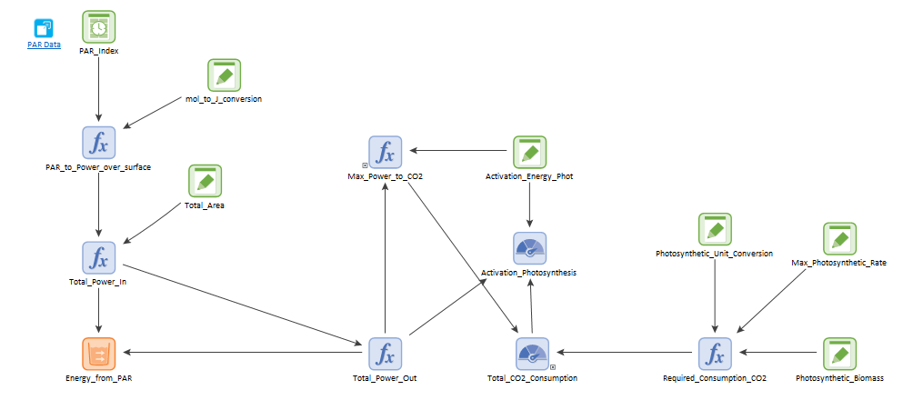

### Metabolism

This module simulates the processes of Respiration, Fermentation, and Photosynthesis. It also models the role of
Photosynthetic Active Radiation (PAR) in photosynthesis and electron Donor-to-Acceptor ratio (eDAR) on 
respiration and fermentation. E. Coli bacteria carry out fermentation and respiration for energy production,
while photosynthesis is carried out by an undefined primary producer. The chemical reactions for these three 
processes are:

Photosynthesis:

$$\begin{equation}
6 CO_2 + 6 H_2 O \rightarror C_6H_{12}O_6 + 6 O_2
\end{equation}$$

Cellular respiration:

$$\begin{equation}
C_6H_{12}O_6 + 6 O_2 \rightarrow 6 CO_2 + 6 H_2 O
\end{equation}$$

Ethanol fermentation:

$$\begin{equation}
C_6H_{12}O_6  \rightarrow C_6H_{12}O_6 + 2 CO_2
\end{equation}$$

These processes defined the state variables in this module: Glucose ($$C_6H_{12}O_6$$), Oxygen ($$6 O_2$$), Water
($$H_2O$$), Carbon Dioxide ($$6 CO_2$$), and Ethanol ($$C_6H_{12}O_6$$). Note that, for Oxygen and Carbon Dioxide
the state variables correspond to the weight of the minimum number of molecules required for a single cycle of 
either metabolic pathway. The units of the state variables were g/m$$^3$$. Although these units are rather uncommon
in chemistry, they were consistent with biomass units of bacteria.

|State variable        |molecular weight (g/m$$^3$$|
|---------------------:|----------:|
|$$C_6H_{12}O_6$$|   2.99e-22  |
|$$6 O_2$$       |    5.31e-23 |
|$$H_2O$$        |    2.99e-23    |
|$$6 CO_2$$      |    7.31e-23      |
|$$C_6H_{12}O_6$$|    2.99e-22    |

Respiration and fermentation outflow glucose and oxygen into the CO2, H2O, and Ethanol pools through 
different functions. One of those functions controls the fraction of respiration and fermentation according
 to the ratio of glucose to oxygen (eDAR, for electron donor to acceptor ratio): when the ratio is low, 
respiration dominates (catabolic environment), and when it is high, fermentation dominates (anaerobic 
environment). The demand for glucose and oxygen is set by a population of bacteria.
The demand for oxygen is computed multiplying the oxygen intake of a single bacteria by the total concentration
of bacteria. The demand for glucose for respiration is calculated considering the oxygen to glucose stoichiometry.
For fermentation we assume the demand is twice as much as that for respiration. The function HeDAR determines the
ratio of glucose used for fermentation and for respiration.

The functions 'Total_Glucose_Intake' and Total_O2_Intake represent the demand of the bacterial community. The functions
'Actual_Anaerobic_Gluc_Intake', 'Actual_Aerobic_Gluc_Intake', and 'Actual_O2_Intake' represent the
actual outflow. The explanation for this is that the demand can (and often will) be higher than the
stock in the pools. These functions go into a splitter and inflow with different rates the pools
of ethanol, $$CO_2$$, and $$H_2O$$. 

Conversely, photosynthesis outflows CO2 and H20 into the glucose and oxygen tanks. 
The photosynthetically active radiation (PAR) limits the rate of photosynthesis. 
[PAR](https://en.wikipedia.org/wiki/Photosynthetically_active_radiation) is the range of wavelengths 
from solar radiation that photosynthetizers can process. It is typically measured in moles of photons 
per area and time. PAR data for this model was obtained from [Ge et al](https://doi.org/10.1007/s00704-010-0368-6).

The PAR modeling follows several steps:

1. Convert PAR Index from $$mole/m^2 h$$ to $$J/m^2 h$$ using Avogadro's number and the following equation 
to calculate the energy of a photon $$\nu$$: $$E_{nu}=\frac{h c}{\lambda}$$, where $$h$$ is planck's constant, $$c$$ is 
the speed of light, and $$\lambda$$ is the wavelength of the photon. In our case, we considered $$\lambda=550 nm$$.

2. Set the area of photosynthetic biomass to extract power. In our case it was $$1 m^2$$.

3. Integrate power over time to extract energy (not strictly necessary)

4. Estimate the maximum amount of $$CO_2$$ that can be metabolized in an hour. Divide power over an hour by
the activation energy for photosynthesis (this gives the number of cycles of photosynthesis)
 and multiply by the weight of six molecules of $$CO_2$$.

5. If the power supplied by PAR in an hour is less than the activation energy for photosynthesis, no $$CO_2$$ is metabolized.

6. If the power demanded by the photosynthetic biomass is higher than the power supplied by PAR, only metabolize the maximum
$$CO_2$$ allowed by PAR.

7. This determines the outflow of the pool of $$CO_2$$ and the outflow of the $$H_2O$$ pool by stoichiometry.

