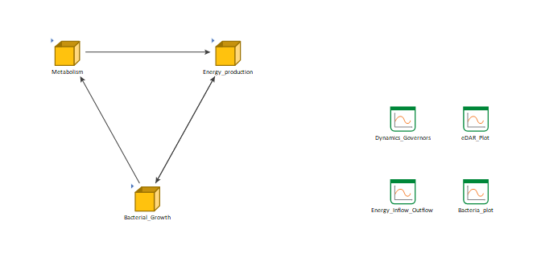
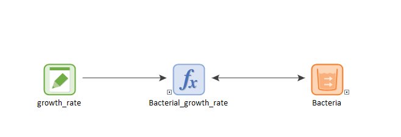

# The Metabolic Machine

[Download](https://github.com/SergioCoboLopez/Workshop_ESA/blob/main/GoldSim_Models/Model5_Metabolic_Machine.gsm){: .btn }

If you find this model useful for your own research, please remember to [cite us](https://github.com/SergioCoboLopez/Workshop_ESA/blob/main/CITATION.cff){: .btn .btn-purple }

This model simulates bacterial growth based on metabolism and energy production. The model consists of three parts stored in their corresponding containers: Metabolism, Energy production, and Bacterial growth.

## Metabolism

The Metabolic container simulates three simplified metabolic processes: respiration, fermentation, and photosynthesis. Bacteria perform respiration and fermentation and photosynthesis is carried out by a generic
non-explicitly modeled primary producer (algae). How much respiration and fermentation is carried out is a function of eDAR (the ratio of glucose to O$$_2$$).
The respiration rate has been obtained from the estimations of O$$_2$$ consumption given by [Riedel et al, 2013](https://doi.org/10.1128/AEM.00756-13). 
The rate of glucose consumption is obtained from stoichiometry of respiration. For simplicity, it was assumed that the fermentation rate is twice the respiration rate.
The photosynthetic rate has been obtained from the data that a gram of leaf metabolizes 44.14 ppm of CO$$_2$$ every minute. The Photosynthetic Active Ratiation (PAR) was obtained 
from [Ge et al, 2010](https://doi.org/10.1007/s00704-010-0368-6)

The technical details of this part of the model are discussed in the corresponding section: 

[Metabolism](https://sergiocobolopez.github.io/Workshop_ESA/GoldSim_Models/Model_5%20-%20Metabolism.html){: .btn }

## Energy production

This module links the available power (energy per time) produced by the metabolic module with the power requested for bacterial growth module. 
The availabe power $$W_{av}$$ is the sum of respirative and fermentative power:

$$\begin{equation}
W_{av}= W^{tot}_{resp} + W^{tot}_{ferm} \, .
\label{eq:W_av}
\end{equation}$$

The respirative and fermentative power are limited by the available biomass for both processes (see 
 the [Metabolism](https://sergiocobolopez.github.io/Workshop_ESA/GoldSim_Models/Model_5%20-%20Metabolism.html) section for details).

The requested power for bacterial growth is the active metabolic power of an E. Coli
bacterium $$W^a_b = 1.39 \cdot 10^{-13}$$ W  [DeLong et al, 2010](https://doi.org/10.1073/pnas.1007783107) multiplied by total bacterial concentration at time $$t$$ and the total volume of the system:

$$\begin{equation}
W_{tot}=B(t) W_b V \, .
\label{eq:W_tot}
\end{equation}$$

The interpretation of Eq ~\ref{eq:W_tot} is that a population of $$B$$ bacteria requests $$W_{tot}$$ to duplicate over the duplication time of an E. Coli bacterial strain.

For the technical details, see:

[Energy production](https://sergiocobolopez.github.io/Workshop_ESA/GoldSim_Models/Model_5-Energy_Production.html){: .btn }

## Bacterial growth

The bacterial growth was defined as:

$$\begin{equation*}
\frac{dB}{dt}= r \frac{W_{av}}{W_{tot}} B \, .
\end{equation*}$$

Here, $$r$$ is the bacterial growth rate, $$W_{av}$$ the available power from metabolism, $$W_{tot}$$ the total power requested from the community of bacteria at time $$t$$ $$B(t)$$.

