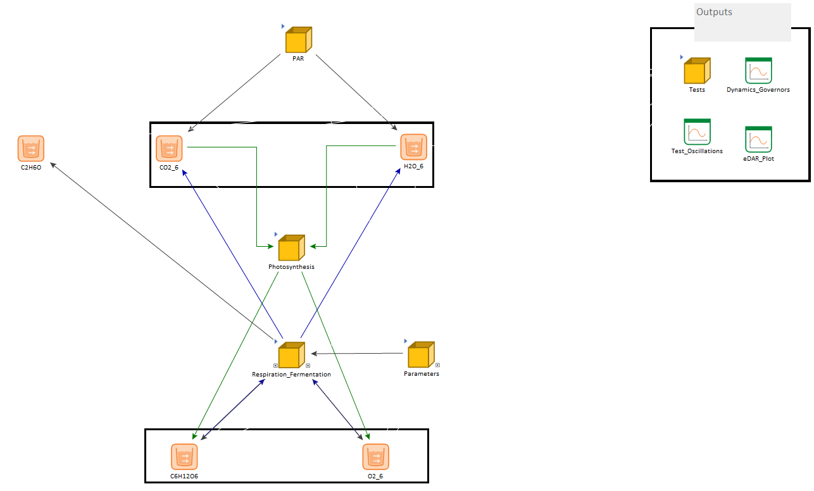
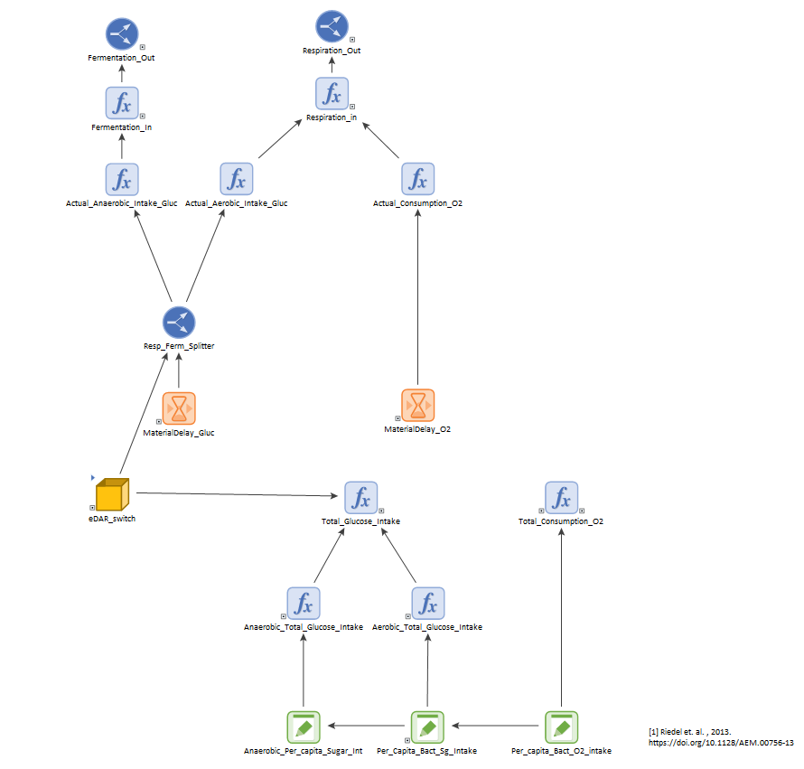
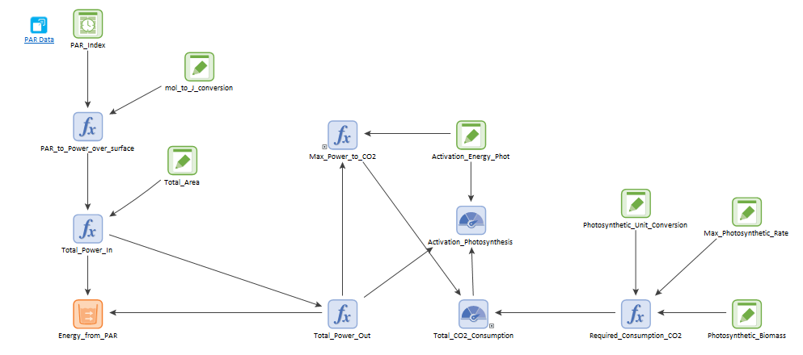

## Model 5 - The Metabolic Machine

This model simulates bacterial growth based on metabolism and energy production. The model comprises
three parts stored in containers: Metabolism, Energy production, and Bacterial growth.

### Metabolism

This part of the model  simulates three simplified metabolic 
processes: respiration, fermentation, and photosynthesis. The central state variables are glucose
 (C6H12O6), oxygen (O2), CO2, H20, and Ethanol (C2H6O). As usual, they 
are encoded by pool elements.

Respiration and fermentation outflow glucose and oxygen into the CO2, H2O, and Ethanol pools through 
different functions. One of those functions controls the fraction of respiration and fermentation according
 to the ratio of glucose to oxygen (eDAR, for electron donor to acceptor ratio): when the ratio is low, 
respiration dominates (catabolic environment), and when it is high, fermentation dominates (anaerobic 
environment). The demand for glucose and oxygen is set by a population of bacteria.

Conversely, photosynthesis outflows CO2 and H20 into the glucose and oxygen tanks. 
The photosynthetically active radiation (PAR) limits the rate of photosynthesis. 
[PAR](https://en.wikipedia.org/wiki/Photosynthetically_active_radiation) is the range of wavelengths 
from solar radiation that photosynthetizers can process. It is typically measured in moles of photons 
per area and time. PAR data for this model was obtained from [Ge et al](https://doi.org/10.1007/s00704-010-0368-6).

