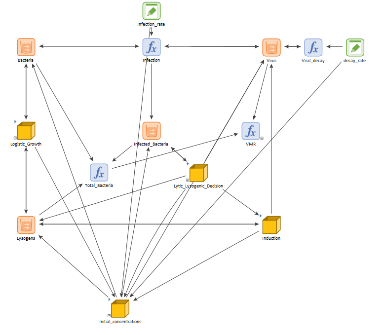

## Dynamical model

### The Math

To model the lytic-lysogenic switch we add several mechanistic processes and two additional state variables: Lysogens ($$L$$) and Infected bacteria ($$I$$). Infected bacteria are those in the process of becoming either lysogens ($$L$$) or new phages via burst:

$$\begin{eqnarray}       
\frac{dB}{dt}&=& \underbrace{r_{max}H''_{eDAR}B}_{growth} - \underbrace{dBP}_{infection} \label{eq:sensitive} \\         
\frac{dP}{dt}&=& \underbrace{c\big(1-P_L\big)\mu_pI}_{\text{lytic burst}} + \underbrace{c\mu_iL}_{\text{induct growth}} - \underbrace{dBP}_{infection} - \underbrace{mP}_{decay} \label{eq:phages} \\                         
\frac{dI}{dt}&=& \underbrace{dBP}_{infection} - \underbrace{\mu_p P_LI}_{lysogenic} - \underbrace{\mu_p\big(1-P_L\big)I}_{lytic} \label{eq:infected} \\  
\frac{dL}{dt}&=& \underbrace{r_{max}H''_{eDAR}L }_{growth} + \underbrace{\mu_p P_LI}_{\text{new lysogens}} - \underbrace{\mu_iL}_{induction} \label{eq:lysogens} \\
\frac{dN}{dt}&=& \underbrace{r_{max}H''_{eDAR}(L+ B)}_{growth} + \underbrace{\mu_p P_LI}_{\text{new lysogens}} - \underbrace{\mu_iL}_{induction} \, ,
\end{eqnarray} $$

where $$B$$, $$I$$, and $$L$$ represent the concentrations of sensitive bacteria, infected bacteria, and lysogens, respectively. $$N$$ is a virtual state variable representing the total bacterial population $$N=B+I+L$$ and $$P$$ is the concentration of phages.

### Equation \ref{eq:sensitive}. B: Sensitive bacteria

The rate of sensitive bacteria is subject to two processes: (exponential) growth and density-dependent infection by phages.

1. Growth: $$r_max H''_{eDAR}$$.
The bacterial growth is controlled by maximum growth rate $$r_max$$ that depends on the bacterial strain and the function $$H''_{eDAR}$$, a modified Hill Function. $$H''_{eDAR}$$ is also a function of eDAR and takes values between 1 (fully catabolic system) and 2 (fully anabolic system) (see [eDAR and switch](https://sergiocobolopez.github.io/Workshop_ESA/GoldSim_Models/Model_6_edar_switch.html) ).

2. Infection: $$dBP$$.
The infection is a function of the density of phages and bacteria (hence density-dependent) and the infection or adsorption rate $$d$$.

### Equation \ref{eq:phages}. P: Phages

Three processes control the rate of phage concentration: lytic burst, induction growth, and phage decay.

1. Lytic burst: $$c\big(1-P_L\big)\mu_pI$$
This term represents the reproduction of phages through lysis of infected bacteria $$I$$. Phages lyse infected bacteria $$I$$ with a probability $$1 - P_L$$ ($$P_L$$ is the probability of lysogeny). For every lysed bacteria, $$c$$ phages reproduce. This process occurs at a rate of $$\mu_p$$.

2. Induction growth: $$c\mu_iL$$
This term represents the phage reproduction via lysogenic induction, which occurs at a rate of $$\mu_i$$.

3. Phage decay: $$mP$$
Phages decay at a rate of $$m$$

### Equation \ref{eq:infected}. I: Infected bacteria

This is the equation where the switch really operates. The rate of infected bacteria is governed by three processes: infection, lysogenic decision, and lytic decision.

1. Infection: $$dBP$$
This term simply implies that the sensitive bacteria infected Eq. \ref{eq:sensitive} become infected.

2. $$\mu_p P_LI$$
This term shows that infected bacteria become lysogens with a probability $$P_L$$ at a rate of $$\mu_p$$

3. $$\mu_p\big(1-P_L\big)I$$
The bacteria that do not become lysogens, will be lysed by phages at a rate of $$mu_p$$

### Equation \ref{eq:lysogens}. L: Lysogens

Three processes control the rate of lysogens: lysogenic growth, new lysogens, and induction.

1. Growth: $$r_{max}H''_{eDAR}L $$
Lysogens growth at the same rate as sensitive bacteria do in Eq. \ref{eq:sensitive}

2. New lysogens: $$\mu_p P_LI$$
This term simply reflects that the infected bacteria in Eq. \ref{eq:infected} become lysogens at a rate of $$\mu_p$$.

3. Induction: $$\mu_iL$$
Lysogens induce and their prophages kill their hosts with a rate of $$\mu_i$$. Subsequently, phages reproduce, as shown in the second term of Eq. \ref{eq:phages}.

### The GoldSim Model

This section discusses the GoldSim representation of the mathematical model discussed above. The figure below shows the GoldSim model:

The pools (orange) represent state variables, the functions (blue) usually represent the terms on the right side of the equations above, the inputs (green) are usually parameter values, and the containers (boxes) contain relatively 
complex parts of the model. For more information go to the main [Models](https://sergiocobolopez.github.io/Workshop_ESA/docs/GoldSim_Models) section or to [Unit 2](https://www.goldsim.com/Courses/BasicGoldSim/Unit2/Lesson1/) of the 
GoldSim introductory course.

**Pools**
 
1. "**Bacteria**" - B in the model above.
2. "**Virus**" - P in the model above
3. "**Infected_Bacteria**" - I in the model above
4. "**Lysogens**" - L in the model above

Every pool has inflows and outflows that correspond to the functions explained below. Inflows correspond to 
Remember that, in GoldSim, a function does not do anything by itself: you need to connect functions to inflows and outflows in the pool elements.

**Functions**

1. **Infection** - This function calculates the number of infected bacteria over time. This is equivalent to the "infection" term in Equations \label{eq:sensitive}, \ref{eq:phages}, \label{eq:infected} .
2. **viral_decay** - This function calculates the number of viruses that decay over time. This is equivalent to the "decay" element in Equation \ref{eq:phages} .
3. **Total_bacteria** - This is equivalent to $$N$$ in the equations above.
4. **VMR** - Virus-to-microbe rate

 
