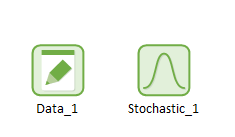
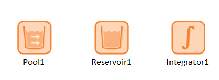
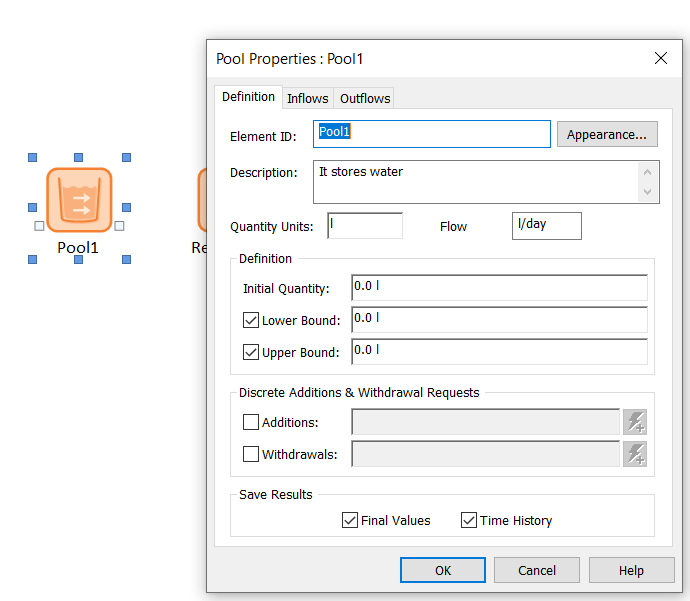
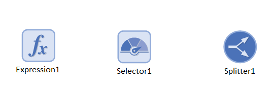
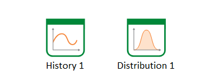
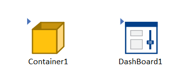

This section covers and describes a series of GoldSim models for microbial ecology dynamical systems. 
Don't forget that GoldSim provides two excellent [free courses](https://www.goldsim.com/Web/Customers/Education/Overview/) and other 
valuable [learning materials](https://www.goldsim.com/Web/Customers/). Additionally, there is a thriving 
[community of users](https://www.goldsim.com/Web/Customers/Community/) who can provide help.

## Modeling elements in GoldSim

For a more detailed description, see the [Unit 2](https://www.goldsim.com/Courses/BasicGoldSim/Unit2/Lesson1/) of the GoldSim 
Introduction Course.

There are seven types of elements or building blocks in GoldSim:

**Inputs**: values you provide GoldSim to run a simulation. They can be just numbers (data elements), datasets, or probability 
distribution (stochastic elements). For example, the growth rate of a population. In this workshop we are going to deal 
primarily with data elements and stochastics.

**Stocks**: These are the state variables or outputs of your model. For example, the population of animals in an ecosystem
or the volume of water in a tank. In this workshop we are going to use the pool element, but the reservoir and integrator are other stock elements.

Note that within the pool element, there are three tabs available: 'Definition', 'Inflows', and 'Outflows'. The 'Inflows' and 'Outflows' tabs
 describe how the contents within the pool will change over time. To better understand this, let's take a look at 
[Model 2](https://sergiocobolopez.github.io/Workshop_ESA/GoldSim_Models/Model_2.html). Within this model, there is a pool called 'Bacteria' 
and a function named 'Bacterial_growth'. To observe actual growth, it is necessary to define this function as an inflow for the pool.

**Functions**: During this workshop, we will be using only three types of functions offered by GoldSim: the Expression, the Selector, 
and the Splitter. The Expression function is extremely versatile, as it can accept any mathematical expression. The Selector function 
allows for the creation of 'if' statements, while the Splitter is utilized for dividing inflows and outflows into different proportions.

**Results**: They show the results of your simulation after execution. We will be using the Time History Result and the Distribution Result.

**Containers**:

**Events**:

**Delays**:

