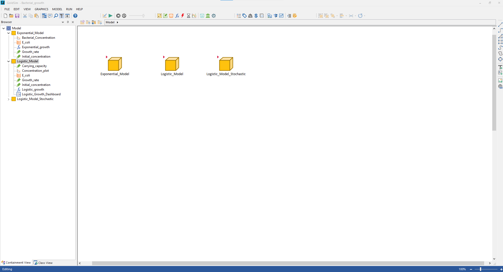

Remember that GoldSim offers two very good [free courses](https://www.goldsim.com/Web/Customers/Education/Overview/) and other [learning resources](https://www.goldsim.com/Web/Customers/). There is also an active [community of users](https://www.goldsim.com/Web/Customers/Community/)

# Models

This section covers a series of models specific for the workshop at the [ESA Annual Meeting](https://esa.org/portland2023/) of 2023. 
---

## Model 1 - Example

Model: <https://github.com/SergioCoboLopez/Workshop_ESA/blob/main/GoldSim_Models/Model1_Example.gsm> 

Video: <https://github.com/SergioCoboLopez/Workshop_ESA/tree/main/data/videos>

This model is a simple example provided by GoldSim in their basic course and can be found [here](https://www.goldsim.com/Courses/BasicGoldSim/Unit3/Lesson2/). The model exploits the analogy of a water management system to describe
a simple scenario and show the basic elements used in GoldSim. 

You can also find a video showing how I built my own version of this model in the repository <https://github.com/SergioCoboLopez/Workshop_ESA/tree/main/data/videos>. 

## Model 2 - Example ecology. 

Model: <https://github.com/SergioCoboLopez/Workshop_ESA/blob/main/GoldSim_Models/Model2_Example_Ecology.gsm>

Video: <https://github.com/SergioCoboLopez/Workshop_ESA/tree/main/data/videos>

You might be asking yourself how water management systems can help describe ecological models. This model gives you a basic answer. Model 2 is a modified version of Model 1 that describes a simulated experiment with bacterial
exponential growth (inflow) and bacterial sampling (outflow).

1. The tank of water becomes now the concentration of bacteria. This is the [state variable](https://en.wikipedia.org/wiki/State_variable) that describes the overall state of our system. Because bacteria are usually measured in concentrations, the 'bacterial tank' units are now 'items/ml' (usually, density is measured in 'cells/ml,' but GoldSim does not provide 'cell' as a standard unit). Remember that GoldSim is very consistent with units.

2. The tank capacity becomes the carrying capacity, the maximum concentration of bacteria in a system.

3. The 'inflow' of bacteria comes from bacterial exponential or Malthusian growth. That is, the bacterial growth is proportional to the actual concentration of bacteria. The time at which the hose switches off is the experiment time.

4. The outflow is reinterpreted as a sampling rate: an extraction of 15% of the total bacterial concentration every hour.

5. This model has a smaller timescale and simulation time.

## Model 3 - Bacterial growth

Model: <https://github.com/SergioCoboLopez/Workshop_ESA/blob/main/GoldSim_Models/Bacterial_growth.gsm>

This model is a refinement of the previous model. The first thing that you will notice when you open it is the existence of a new element:

Image courtesy of GoldSim

The three yellow elements are called [containers](https://www.goldsim.com/Courses/BasicGoldSim/Unit9/Lesson2/). Containers are used to store small parts of the models for esthetical reasons (not having lots of elements
scattered around your workspace) or because you want to build a modular model, where each part of your model is as independent as possible from the rest.

This one is our model for Lytic-Lysogenic interactions

You can find and download this model in the repository at <https://github.com/SergioCoboLopez/Workshop_ESA/tree/main/GoldSim_Models>

### GoldSim player files
In the event that you cannot access or use GoldSim, I have provided three player files. GoldSim player files can be run with GoldSim player, but they cannot be edited.

## GoldSim player 1

This file can be found in the [repository](https://github.com/SergioCoboLopez/Workshop_ESA/tree/main/GoldSim_Models/Player_Files) under the name Bacterial_growth.gsp.
The model simulates the bacterial growth of three bacterial strains using values found in the literature. In the player file, you can select several parameters to play around.

## GoldSim player 2
This file can be found under the name Bacterial_growth_stochastic.gsp.
In this model I introduced stochasticity to account for variables that cannot be controled in experimental settings: the bacterial growth rate is not a fixed number, but an average depending on different factors. The same applies to the carrying capacity.

## GoldSim player 3
This file can be found under the name Lotka_Volterra.gsp.

In this model, I simulate a predator-prey model for bacteria and virulent phage with Lotka-Volterra equations. The model comprises for ecological mechanisms: exponential bacterial growth, infection of bacteria by phages, phage growth by burst, and phage decay.

---
