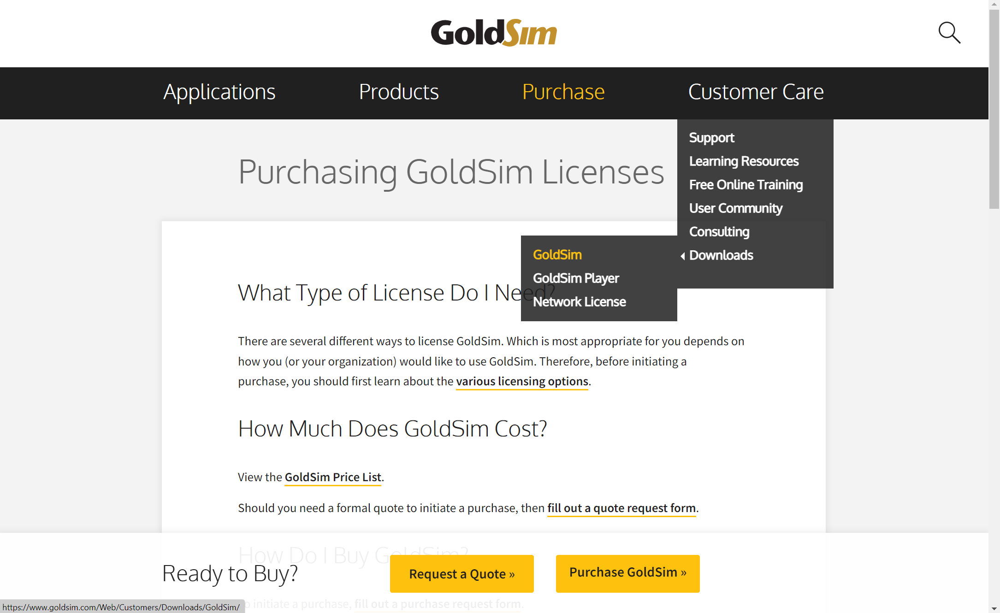

## Instructions

1. You can download GoldSim [from the website](https://www.goldsim.com/Web/Customers/Downloads/GoldSim/Latest/).

Image courtesy of GoldSim

2. Click on the download button

Image courtesy of GoldSim

3. Once downloaded, run the .exe file.

4. During the installation process, you will be asked to input your activation id. This activation id will be provided to you during the workshop. If you have purchased GoldSim, or if you have requested an [academic](https://www.goldsim.com/Web/Purchase/AcademicResearch/#RequestAcademic) or [trial](https://www.goldsim.com/Forms/Trial/) license, you should have received an activation id.