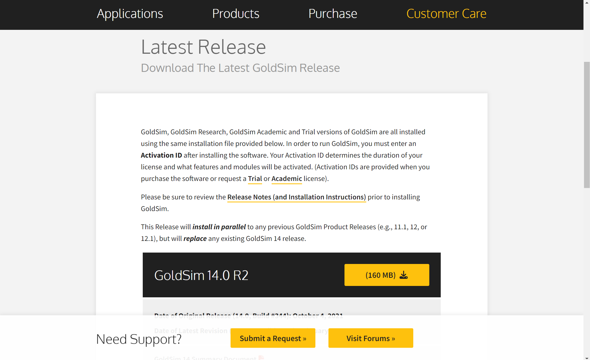

## Instructions

1. You can download GoldSim [from the website](https://www.goldsim.com/Web/Customers/Downloads/GoldSim/Latest/).

Image courtesy of GoldSim

2. Click on the download button

Image courtesy of GoldSim

3. Once downloaded, run the .exe file.

4. During the installation process, you will be asked to input your activation id. This activation id will be provided to you during the workshop. If you have purchased GoldSim, or if you have requested an [academic](https://www.goldsim.com/Web/Purchase/AcademicResearch/#RequestAcademic) or [trial](https://www.goldsim.com/Forms/Trial/) license, you should have received an activation id.

### Installing GoldSim player
GoldSim player allows you to run certain files in GoldSim (player files) like the ones provided in the [repository](https://github.com/SergioCoboLopez/Workshop_ESA/tree/main/GoldSim_Models/Player_Files). You cannot edit or change models, but it can be a useful option if you want to get an intuition of how GoldSim works.

1. To install GoldSim player, go to the [download page](https://www.goldsim.com/Web/Customers/Downloads/Player/)

Image courtesy of GoldSim

2. Click on the download button

Image courtesy of GoldSim

3. After downloading, and installing GoldSim Player, open it.

Image courtesy of GoldSim

4. Player files look something like this:

Image courtesy of GoldSim. The model can be found in the repository with the name 'Bacterial_Growth.gsp'

5. Remember that GoldSim Player will only allow you to open Player files with the extension '.gsp'. To enable dashboard functionality, it's necessary to model player files. 
The [GoldSim Introduction Course](https://www.goldsim.com/Courses/BasicGoldSim/) provides guidance on how to create player files:  

## After installation

I strongly recommend following the [Introduction to GoldSim course](https://www.goldsim.com/Courses/BasicGoldSim/) and downloading the zip file with the exercises and examples. 
It is recommended that you finish the first four lessons before starting your projects, but it is even better to complete the first nine lessons if possible.

Open the GoldSim density-dependent model and play around with it. If you can’t find it, contact the GoldSim responsible person. What happens when you change the model's initial concentrations or growth rates? How does this model fit into your own project?

## Working on your own project: some tips

Before starting your own model in GoldSim, think about these questions:

1. What is your hypothesis for this model?
2. Do you need to do this? Has anyone done this before you? Ask or look at the literature.
3. What are the requirements (i.e., expected inputs and outputs)? Are they reasonable and realistic?
4. Before starting your model, sketch a diagram of what your model should do. [Cybernetic](https://en.wikipedia.org/wiki/Cybernetics) diagrams or tables can be useful.
5. Are the requirements still consistent with your cybernetic diagram or table? Modify them if they are not.
6. In most cases your model will need parameters or [data elements](https://help.goldsim.com/index.html#!Modules/5/inputelements.htm)  to work. Can you get their values from an experiment or the literature? 
7. What is a reasonable deadline to have the first version of the model, and what can you realistically do before that deadline? (remember that coding usually takes longer than expected)
8. Write an initial version of your model in paper (pseudo-code) 
9. Do a minimal version of the model that you can test.
10. Test that version and verify it works.
11. Start documenting your model and doing [version control](https://www.atlassian.com/git/tutorials/what-is-version-control#:~:text=Version%20control%2C%20also%20known%20as,to%20source%20code%20over%20time.). Use a [GitHub](https://github.com/) repository or other platform.
12. You never finish a model: you just do another iteration of it.

