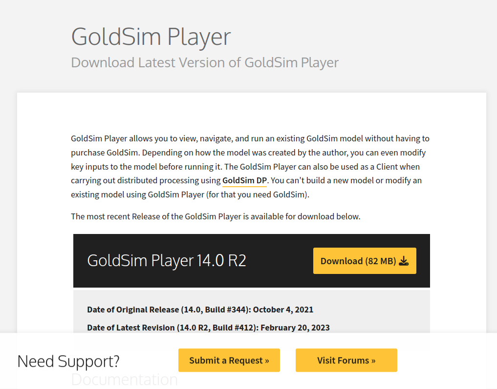
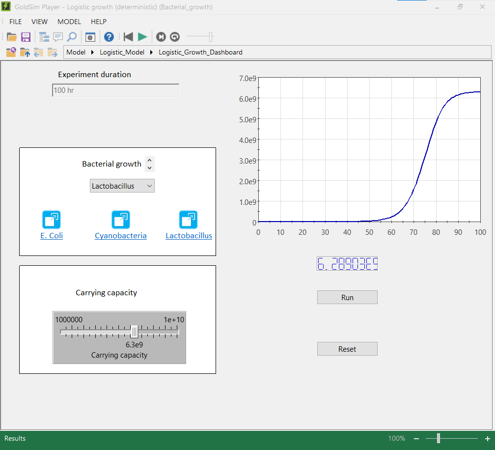

## Installing GoldSim player

GoldSim player allows you to run certain files in GoldSim (player files) like the ones provided in the [repository](https://github.com/SergioCoboLopez/Workshop_ESA/tree/main/GoldSim_Models/Player_Files). You cannot edit or change models, but it can be a useful option if you want to get an intuition of how GoldSim works.

1. To install GoldSim player, go to the [download page](https://www.goldsim.com/Web/Customers/Downloads/Player/)

Image courtesy of GoldSim

2. Click on the download button

Image courtesy of GoldSim

3. After downloading, and installing GoldSim Player, open it.

Image courtesy of GoldSim

4. Player files look something like this:

Image courtesy of GoldSim. The model can be found in the repository with the name 'Bacterial_Growth.gsp'

5. Remember that GoldSim Player will only allow you to open Player files with the extension '.gsp'. To enable dashboard functionality, it's necessary to model player files. 
The [GoldSim Introduction Course](https://www.goldsim.com/Courses/BasicGoldSim/) provides guidance on how to create player files.